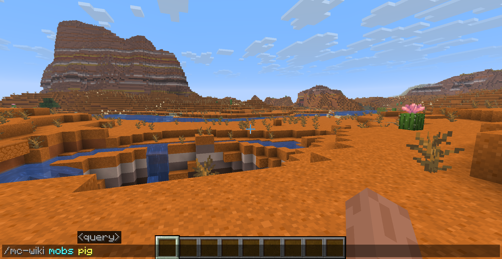
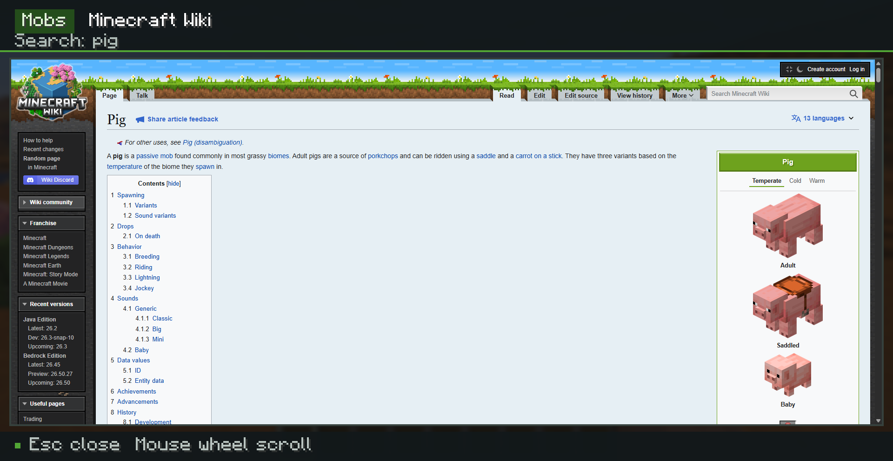
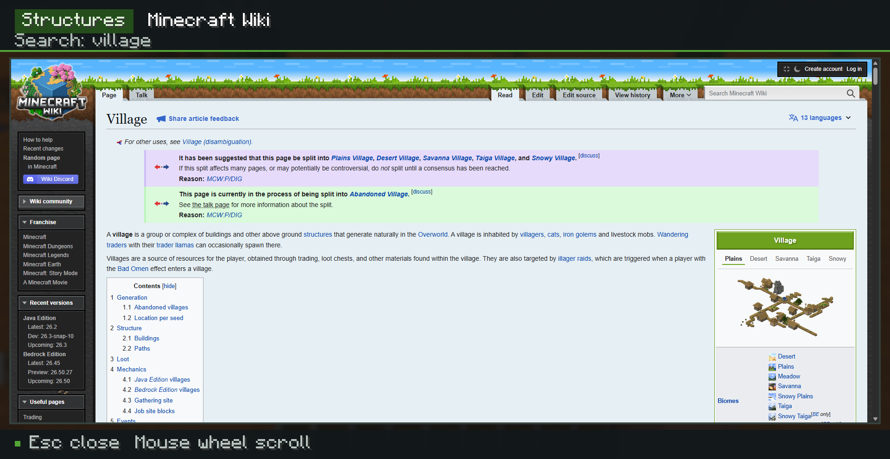

# Minecraft Wiki Mod

 [简体中文](./doc/README_ZHCN.md)

Minecraft Wiki Mod is a client-side Fabric mod that lets you search the Minecraft Wiki directly from Minecraft and read the result without leaving the game.

Enter a command, choose what you want to search for, and the mod will find the best matching Minecraft Wiki article through the MediaWiki API. The selected page is then opened in an in-game browser powered by [MCEF Modern](https://github.com/CinemaMod/mcef).

> Search the Wiki. Read the article. Stay in Minecraft.

## Features

- Search Minecraft Wiki articles directly with in-game commands.
- Automatically select the best matching Wiki article for your query.
- Open Wiki pages inside Minecraft using the MCEF Modern browser.
- Support both the English and Chinese Minecraft Wiki.
- Remember the selected Wiki language in a client-side configuration file.
- Work entirely on the client side, including on multiplayer servers that do not have the mod installed.

## Preview

For example, if you want to look up information about pigs, run:

```text
/mc-wiki mobs pig
```

The mod searches the selected Minecraft Wiki for the best matching article and opens the corresponding page directly inside Minecraft.

<!-- Replace this path with your screenshot later. -->


You can then browse the article just like a normal Wiki page without switching to an external browser.

<!-- Replace this path with your in-game browser screenshot later. -->


Another example:

```text
/wiki structures village
```

The result:


This searches the `structures` category for `village` and opens the best matching Village-related Wiki article in the in-game browser.

## Requirements

| Dependency    | Version                   | Required |
| ------------- | ------------------------- | -------- |
| Minecraft     | 26.2                      | Yes      |
| Java          | 25 or newer               | Yes      |
| Fabric Loader | 0.19.3 or newer           | Yes      |
| Fabric API    | 0.158.0+26.2              | Yes      |
| MCEF Modern   | 0.3.3+mc26.2.jcef146.0.10 | Yes      |

Minecraft Wiki Mod is client-side only. It works in both singleplayer and multiplayer, and multiplayer servers do not need to install the mod.

## Installation

1. Install Fabric Loader for Minecraft 26.2.
2. Download Fabric API, MCEF Modern, and Minecraft Wiki Mod.
3. Place all required JAR files in the client's `mods` directory.
4. Start Minecraft using the Fabric profile.

> [!NOTE]
> MCEF Modern may need to download and extract the JCEF browser runtime during its first initialization. An internet connection is required, and the first startup may take longer than usual.

## Usage

The main command is:

```text
/mc-wiki <category> <query>
```

The following aliases are also available:

```text
/mcwiki <category> <query>
/wiki <category> <query>
```

### Examples

Search for the Pig article:

```text
/mc-wiki mobs pig
```

Search for Redstone-related information:

```text
/mc-wiki blocks redstone
```

Search for a Village article using the short alias:

```text
/wiki structures village
```

### Search Categories

The following categories are currently available:

| Category          | Intended search scope                 |
| ----------------- | ------------------------------------- |
| `trade`           | Trading and villager-related content  |
| `brewing`         | Brewing and potions                   |
| `enchanting`      | Enchantments and enchanting mechanics |
| `mobs`            | Mobs and entities                     |
| `blocks`          | Blocks                                |
| `items`           | Items                                 |
| `biome`           | Biomes                                |
| `status_effects`  | Status effects                        |
| `crafting`        | Crafting recipes and mechanics        |
| `smelting`        | Smelting-related content              |
| `smithing`        | Smithing-related content              |
| `structures`      | Generated structures                  |
| `redstone`        | Redstone components and mechanics     |
| `commands`        | Minecraft commands                    |
| `version_history` | Version and update history            |
| `tutorials`       | Minecraft Wiki tutorials              |

Command completion is available, so you do not need to remember every category name manually.

## Language Settings

Minecraft Wiki Mod can search either the English or Chinese Minecraft Wiki.

Show the currently selected Wiki language:

```text
/mc-wiki settings lang get
```

Switch to the English Wiki:

```text
/mc-wiki settings lang set en_us
```

Switch to the Chinese Wiki:

```text
/mc-wiki settings lang set zh_cn
```

`en_us` searches `minecraft.wiki`, while `zh_cn` searches `zh.minecraft.wiki`.

The selected language also controls the language used by the mod's GUI and command feedback.

The client configuration is stored at:

```text
config/minecraft-wiki/mc-wiki-client.properties
```

## How It Works

When you execute a Wiki search command, the mod follows this process:

```text
Minecraft Command
       |
       v
Category + Query + Wiki Language
       |
       v
MediaWiki API Search
       |
       v
Best Matching Article
       |
       v
MCEF Modern In-Game Browser
```

In more detail:

1. The client command reads the selected category, search query, and Wiki language.
2. The mod sends a search request to the corresponding Minecraft Wiki through the MediaWiki API.
3. Matching pages are returned and the mod selects the best matching article.
4. MCEF Modern loads the selected Wiki page inside a Minecraft GUI.

This means the entire interaction stays inside the Minecraft client, from entering the command to reading the article.


## Development

The project uses the Gradle Wrapper and Fabric Loom, so a separate Gradle installation is not required.

### Windows

```powershell
.\gradlew.bat build
.\gradlew.bat runClient
.\gradlew.bat runDatagen
.\gradlew.bat check
```

### Linux / macOS

```bash
./gradlew build
./gradlew runClient
./gradlew runDatagen
./gradlew check
```

Build artifacts are written to:

```text
build/libs
```

Fabric Datagen writes generated language files to:

```text
src/main/generated/assets/mc-wiki/lang/en_us.json
src/main/generated/assets/mc-wiki/lang/zh_cn.json
```

## License

This project is licensed under the [GNU LGPL 2.1](LICENSE).