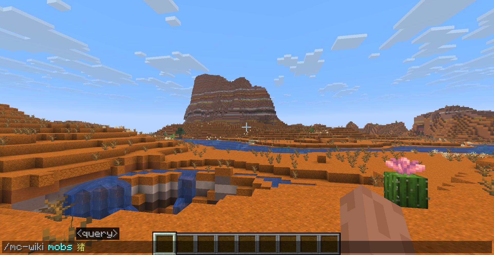

# Minecraft Wiki Mod

[English](../README.md)

Minecraft Wiki Mod 是一个客户端 Fabric 模组，可以让你直接在 Minecraft 游戏内搜索 Minecraft Wiki，并在不离开游戏的情况下阅读搜索结果。

你只需要输入命令并选择想要搜索的内容，模组就会通过 MediaWiki API 查找最匹配的 Minecraft Wiki 文章。随后，选中的页面会通过 [MCEF Modern](https://github.com/CinemaMod/mcef) 提供的游戏内浏览器打开。

> 搜索 Wiki。阅读文章。留在 Minecraft 中。

## 功能

- 直接通过游戏内命令搜索 Minecraft Wiki 文章。
- 自动为搜索内容选择最匹配的 Wiki 文章。
- 使用 MCEF Modern 浏览器直接在 Minecraft 内打开 Wiki 页面。
- 支持英文和中文 Minecraft Wiki。
- 在客户端配置文件中记住当前选择的 Wiki 语言。
- 完全在客户端运行，即使多人服务器未安装本模组也可以使用。

## 预览

例如，如果你想查询猪（Pig）的相关信息，可以输入：

```text
/mc-wiki mobs pig
```

模组会在当前选择的 Minecraft Wiki 中搜索最匹配的文章，并直接在 Minecraft 内打开对应页面。



随后，你可以像浏览普通 Wiki 页面一样阅读文章，而无需切换到外部浏览器。


另一个例子：

```text
/wiki structures village
```

搜索结果：


该命令会在 `structures` 分类中搜索 `village`，并在游戏内浏览器中打开最匹配的村庄（Village）相关 Wiki 文章。

## 运行要求

| 依赖 | 版本 | 是否必需 |
| --- | --- | --- |
| Minecraft | 26.2 | 是 |
| Java | 25 或更高版本 | 是 |
| Fabric Loader | 0.19.3 或更高版本 | 是 |
| Fabric API | 0.158.0+26.2 | 是 |
| MCEF Modern | 0.3.3+mc26.2.jcef146.0.10 | 是 |

Minecraft Wiki Mod 是一个纯客户端模组。它既可以在单人游戏中使用，也可以在多人游戏中使用，并且多人服务器无需安装本模组。

## 安装

1. 为 Minecraft 26.2 安装 Fabric Loader。
2. 下载 Fabric API、MCEF Modern 和 Minecraft Wiki Mod。
3. 将所有必需的 JAR 文件放入客户端的 `mods` 目录。
4. 使用 Fabric 配置启动 Minecraft。

> [!NOTE]
> MCEF Modern 在首次初始化时可能需要下载并解压 JCEF 浏览器运行时，因此需要网络连接，并且第一次启动可能会比平时耗时更长。

## 使用方法

主命令为：

```text
/mc-wiki <category> <query>
```

同时也支持以下别名：

```text
/mcwiki <category> <query>
/wiki <category> <query>
```

### 示例

搜索猪（Pig）文章：

```text
/mc-wiki mobs pig
```

搜索红石相关信息：

```text
/mc-wiki blocks redstone
```

使用简短别名搜索村庄（Village）文章：

```text
/wiki structures village
```

### 搜索分类

目前支持以下分类：

| 分类 | 搜索范围 |
| --- | --- |
| `trade` | 交易和村民相关内容 |
| `brewing` | 酿造与药水 |
| `enchanting` | 附魔及附魔机制 |
| `mobs` | 生物与实体 |
| `blocks` | 方块 |
| `items` | 物品 |
| `biome` | 生物群系 |
| `status_effects` | 状态效果 |
| `crafting` | 合成配方与合成机制 |
| `smelting` | 熔炼相关内容 |
| `smithing` | 锻造相关内容 |
| `structures` | 生成结构 |
| `redstone` | 红石组件与红石机制 |
| `commands` | Minecraft 命令 |
| `version_history` | 版本与更新历史 |
| `tutorials` | Minecraft Wiki 教程 |

命令支持自动补全，因此你不需要手动记住所有分类名称。

## 语言设置

Minecraft Wiki Mod 可以搜索英文或中文 Minecraft Wiki。

查看当前选择的 Wiki 语言：

```text
/mc-wiki settings lang get
```

切换到英文 Wiki：

```text
/mc-wiki settings lang set en_us
```

切换到中文 Wiki：

```text
/mc-wiki settings lang set zh_cn
```

`en_us` 会搜索 `minecraft.wiki`，而 `zh_cn` 会搜索 `zh.minecraft.wiki`。

所选择的语言同时也会控制模组 GUI 和命令反馈所使用的语言。

客户端配置文件保存在：

```text
config/minecraft-wiki/mc-wiki-client.properties
```

## 工作原理

当你执行 Wiki 搜索命令时，模组会按照以下流程工作：

```text
Minecraft 命令
       |
       v
分类 + 搜索内容 + Wiki 语言
       |
       v
MediaWiki API 搜索
       |
       v
最匹配的文章
       |
       v
MCEF Modern 游戏内浏览器
```

具体流程如下：

1. 客户端命令读取所选择的分类、搜索内容和 Wiki 语言。
2. 模组通过 MediaWiki API 向对应的 Minecraft Wiki 发送搜索请求。
3. API 返回匹配的页面后，模组会从中选择最匹配的文章。
4. MCEF Modern 在 Minecraft GUI 中加载所选择的 Wiki 页面。

这意味着从输入命令到阅读文章，整个交互过程都可以在 Minecraft 客户端内部完成。

## 开发

本项目使用 Gradle Wrapper 和 Fabric Loom，因此无需单独安装 Gradle。

### Windows

```powershell
.\gradlew.bat build
.\gradlew.bat runClient
.\gradlew.bat runDatagen
.\gradlew.bat check
```

### Linux / macOS

```bash
./gradlew build
./gradlew runClient
./gradlew runDatagen
./gradlew check
```

构建产物会输出到：

```text
build/libs
```

Fabric Datagen 生成的语言文件位于：

```text
src/main/generated/assets/mc-wiki/lang/en_us.json
src/main/generated/assets/mc-wiki/lang/zh_cn.json
```

## 许可证

本项目使用 [GNU LGPL 2.1](../LICENSE) 许可证。
